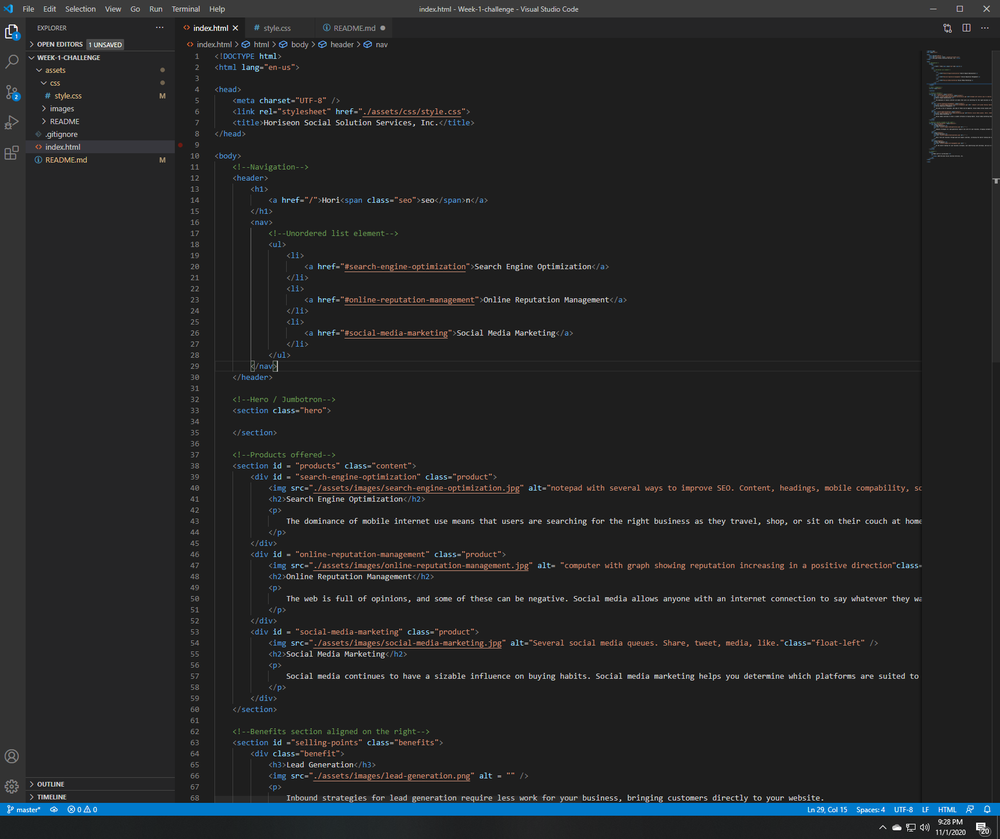
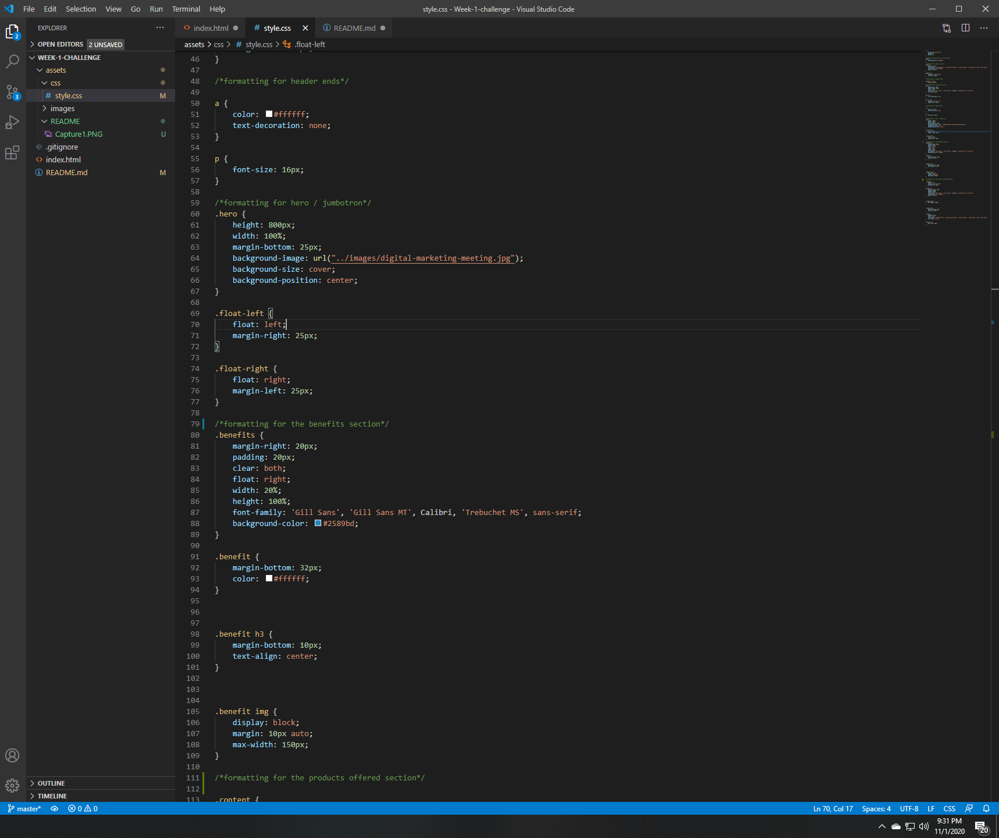

# Code Refactor Starter Code

## Overview

The purpose of my me refactoring this starter code is make sure the website adheres to accessibility standards.

### Gallery

### Problem

HTML Code was missing semantic HTML elments.  It was also missing important comments to help organize the different sections of code.

CSS code had redundant selectors that made the code unnecessarily repetative.  

CSS file was missing comments to help organize formatting to differenct HTML sections.

Images were missing alt tags.

Title was missing from web page

### Solution

Added semantic HTML code to help distinguish different sections of code.

Added alt tags that were appropriate for images that needed them.

Added a title to the web page

Class and ID's were assigned to help consolidate CSS code and remove any unnecessary repitition.

Added header and footer tags to replace excessive div tags.